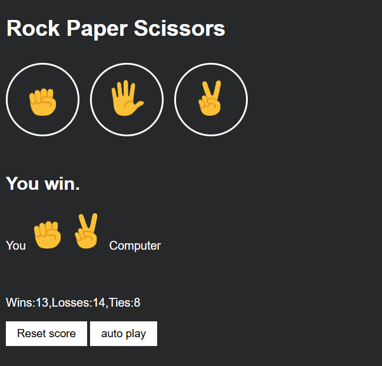

# ✂️ Rock Paper Scissors Game ✊✋✌️

A simple Rock-Paper-Scissors game built using HTML, CSS, and JavaScript. Play against the computer and test your luck!

## 🔗 Live Demo
[Click here to play!](https://anisha-mahto.github.io/Rock_Paper_Scissor/) 

## 🚀 Features
- 🎮 Classic Rock-Paper-Scissors gameplay
- 🤖 Computer chooses random moves
- 🧠 Score tracking with `localStorage`
- 🔁 Auto-play mode
- ⌨️ Play using keyboard shortcuts (R, P, S)
- 🧼 Reset score button
  
## 🛠️ Technologies Used
- HTML
- CSS
- JavaScript

## 📂 Project Structure
Rock_Paper_Scissor/
├── index.html # Main HTML file
├── 12-rock-paper-scissors.css # CSS styles
├── 12-rock-paper-scissors.js # JavaScript logic
├── rock-emoji.png
├── paper-emoji.png
├── scissors-emoji.png # Emoji images
├── screenshot.png # Screenshot for README
└── README.md

🙌 Acknowledgements
Built as part of learning front-end development. Inspired by beginner JavaScript projects for hands-on practice.
